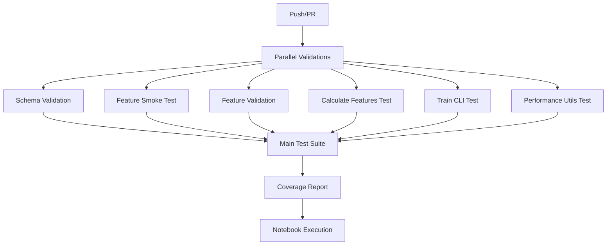

# Conviction-AI Machine Learning Pipeline

[](https://github.com/amr522/conviction-ai-clean/releases/tag/v2.1.0)
[](htmlcov/index.html)

This repository contains the Conviction-AI machine learning pipeline, which automates data processing, model training, and deployment to AWS.

## 🚀 Quick Start

**New to the project?** Get up and running in minutes with our [**Quickstart Guide**](QUICKSTART.md)!

## 📋 Table of Contents

- [Environment Setup](#environment-setup)
- [Repository Structure](#repository-structure)
- [AWS Pipeline](#aws-pipeline)
- [Running Tests Locally](#running-tests-locally)
- [CI/CD Pipeline](#cicd-pipeline)
- [Slack Notifications](#sla## 🔍 Data Validation Framework

We've implemented a comprehensive framework for validating data quality and preventing forward-looking bias in our machine learning pipeline. This includes:

- Feature validation with Spark Window functions and pandas
- Great Expectations integration for ETL validation
- Time-series split and early stopping for all training scripts
- **Raw data fallback & schema enforcement** - automatic fallback to backup data sources

For details, see [DATA_VALIDATION.md](DATA_VALIDATION.md).

### Raw Data Fallback & Schema Enforcement

Every `clean_*.py` script now includes automatic fallback to backup raw data with schema validation:

1. **Primary Path**: Scripts first attempt to load from canonical raw data location
2. **Schema Validation**: Raw data is validated against JSON schemas in `schemas/`
3. **Automatic Fallback**: If primary fails, scripts automatically fall back to `data/Parquet_data/Raw/`
4. **Logging**: Fallback events are logged as warnings for monitoring

**Environment Variables:**
- `RAW_BACKUP_DIR`: Override default backup directory (default: `data/Parquet_data/Raw`)

**Example Usage:**
```bash
# Set custom backup directory
export RAW_BACKUP_DIR=/path/to/backup/data

# Run cleaning script - will automatically fallback if needed
python src/clean_options_daily.py --date 2025-01-15
```

## 📈 Volatility Prediction Features

The Conviction-AI pipeline now includes advanced volatility prediction features that enhance the existing implied volatility (IV) change prediction capabilities. These new features enable more sophisticated volatility trading strategies.

### Volatility Target Columns

The pipeline generates and uses the following volatility-related target columns:

- **sigma_forecast_5d**: 5-day volatility forecast using EGARCH models, providing forward-looking volatility estimates
- **ivhv_spread_tplus1**: The spread between implied volatility (IV) and historical volatility (HV) for t+1, a key mean-reversion indicator

### Multi-Target Training

The machine learning models can now be trained with multiple target columns simultaneously:

1. **RandomForestRegressor with MultiOutputRegressor**: Train a single model to predict multiple volatility targets
2. **LightGBM Blender**: Enhanced to support volatility targets with fallback mechanism to iv_change_5d
3. **PatchTST with Multi-Target Support**: Deep learning time series model updated for multi-target prediction

### Using Volatility Targets

To use the volatility targets in your training and prediction workflows:

1. **Create holdout dataset with volatility targets**:
   ```bash
   python create_holdout_csv.py --include-volatility-targets
   ```

2. **Train models with multiple volatility targets**:
   ```bash
   python train_patchtst_tail.py --target-columns "tail_event,sigma_forecast_5d,ivhv_spread_tplus1"
   ```

3. **Run SageMaker Autopilot with volatility target**:
   ```bash
   python run_sagemaker_autopilot.py --target-column sigma_forecast_5d
   ```

### Volatility Targets Demo

For a comprehensive demonstration of the volatility targets workflow, run the included Jupyter notebook:

```bash
jupyter notebook volatility_targets_demo.ipynb
```

The notebook provides:
- Data loading and exploration of volatility features
- Training workflows for multi-target models
- Visualization of feature importance for volatility prediction
- Performance evaluation across different volatility targets

## 📚 Additional Documentationtions)
- [AWS Resources](#aws-resources)
- [Data Validation Framework](#data-validation-framework)
- [Volatility Prediction Features](#volatility-prediction-features)
- [Additional Documentation](#additional-documentation)

The pipeline generates and uses the following volatility-related target columns:

- **sigma_forecast_5d**: 5-day volatility forecast using EGARCH models, providing forward-looking volatility estimates
- **ivhv_spread_tplus1**: The spread between implied volatility (IV) and historical volatility (HV) for t+1, a key mean-reversion indicator

### Multi-Target Training

The machine learning models can now be trained with multiple target columns simultaneously:

1. **RandomForestRegressor with MultiOutputRegressor**: Train a single model to predict multiple volatility targets
2. **LightGBM Blender**: Enhanced to support volatility targets with fallback mechanism to iv_change_5d
3. **PatchTST with Multi-Target Support**: Deep learning time series model updated for multi-target prediction

### Using Volatility Targets

To use the volatility targets in your training and prediction workflows:

1. **Create holdout dataset with volatility targets**:
   ```bash
   python create_holdout_csv.py --include-volatility-targets
   ```

2. **Train models with multiple volatility targets**:
   ```bash
   python train_patchtst_tail.py --target-columns "tail_event,sigma_forecast_5d,ivhv_spread_tplus1"
   ```

3. **Run SageMaker Autopilot with volatility target**:
   ```bash
   python run_sagemaker_autopilot.py --target-column sigma_forecast_5d
   ```

### Volatility Targets Demo

For a comprehensive demonstration of the volatility targets workflow, run the included Jupyter notebook:

```bash
jupyter notebook volatility_targets_demo.ipynb
```

The notebook provides:
- Data loading and exploration of volatility features
- Training workflows for multi-target models
- Visualization of feature importance for volatility prediction
- Performance evaluation across different volatility targets

## 📚 Additional Documentationicd-pipeline)
- [Slack Notifications](#slack-notifications)
- [AWS Resources](#aws-resources)
- [Data Validation Framework](#data-validation-framework)
- [Additional Documentation](#additional-documentation)

## 🔧 Environment Setup

### Local Development Setup

```bash
./scripts/setup-env.sh
source .venv/bin/activate
```

Then you can run:
```bash
./scripts/evaluate_pipeline.sh 2025-07-27
```

### DevContainer Development Environment

We provide a VS Code DevContainer with all dependencies installed.

1. Open this project in VS Code.
2. When prompted, reopen in DevContainer.
3. The `scripts/setup-env.sh` will run automatically to create a virtualenv and install dependencies.

You'll have:
- A consistent Python environment (`.venv`)
- Recommended extensions installed automatically
- AutoSave and FormatOnSave enabled

### Code Quality Setup

Pre-commit hooks enforce code quality standards:

```bash
pip install pre-commit
pre-commit install
```

This enables automatic code formatting, import sorting, type checking, and commit message validation on every commit.

### Type Checking

Run mypy locally for comprehensive type checking:

```bash
mypy --config-file=mypy.ini src/
```

### Test Coverage

Run tests with coverage measurement:

```bash
# Install test dependencies first
./scripts/install-test-deps.sh

# Run tests with coverage
coverage run -m pytest
coverage report --fail-under=80
```

Generate HTML coverage report:

```bash
coverage html
```

Tests must meet a minimum of 80% code coverage to pass.

### Prerequisites

- Python 3.9+
- AWS CLI installed and configured
- Appropriate AWS IAM permissions for S3, Glue, and SageMaker
- Git

### Setting Up the Project

1. Clone the repository:
   ```bash
   git clone https://github.com/your-organization/conviction-ai-clean.git
   cd conviction-ai-clean
   ```

2. Create a virtual environment and install dependencies:
   ```bash
   python -m venv venv
   source venv/bin/activate  # On Windows: venv\Scripts\activate
   pip install -r requirements.txt
   ```

3. Configure environment variables:

   Create a `.env` file with the following required variables:
   ```
   # AWS credentials (or use IAM roles)
   AWS_ACCESS_KEY_ID=your_key_id
   AWS_SECRET_ACCESS_KEY=your_secret_key
   AWS_REGION=us-east-1

   # S3 bucket for data storage
   S3_BUCKET_NAME=your-bucket-name

   # Telegram bot for notifications
   TELEGRAM_BOT_TOKEN=your_bot_token_here
   TELEGRAM_CHAT_ID=your_chat_id_here
   ```

4. For Telegram notifications integration:
   - Create a Telegram bot via @BotFather
   - Get your bot token and chat ID
   - Add the bot token and chat ID to your `.env` file

   ```bash
   export TELEGRAM_BOT_TOKEN="1234567890:ABCdefGHIjklMNOpqrsTUVwxyz"
   export TELEGRAM_CHAT_ID="-1001234567890"
   ```

   **Testing Locally:**
   ```bash
   # Test with dummy credentials (dry-run mode)
   export TELEGRAM_BOT_TOKEN="dummy"
   export TELEGRAM_CHAT_ID="dummy"
   python -c "from src.telegram_alerts import send_message; send_message('TEST','Hello from Conviction-AI!')"
   ```

## 📁 Repository Structure

The repository is organized into the following key directories:

```
conviction-ai-clean/
├── aws_pipeline/            # AWS SageMaker and pipeline components
│   ├── model_analysis.py    # Tools for model evaluation and analysis
│   ├── run_aws_pipeline.sh  # Main script to execute the full AWS pipeline
│   ├── setup_aws_env.sh     # Setup script for AWS environment
│   └── README.md            # AWS pipeline documentation
├── data/                    # Data directory (not tracked in git)
│   ├── raw/                 # Raw data files
│   ├── processed/           # Processed data files
│   └── predictions/         # Model predictions
├── tests/                   # Test suite
├── .env                     # Environment variables (not tracked in git)
├── .gitignore               # Git ignore file
├── requirements.txt         # Python dependencies
└── README.md                # Main documentation
```

## ☁️ AWS Pipeline

The `aws_pipeline` directory contains all components for the AWS SageMaker and data processing pipeline. This includes scripts for model training, deployment, and analysis.

### Setup and Configuration

To set up the AWS environment:

1. Navigate to the aws_pipeline directory:
   ```bash
   cd aws_pipeline
   ```

2. Make the setup script executable and run it:
   ```bash
   chmod +x setup_aws_env.sh
   ./setup_aws_env.sh
   ```

### Running the Pipeline

To execute the full AWS pipeline:

1. Make the pipeline script executable:
   ```bash
   chmod +x run_aws_pipeline.sh
   ```

2. Run the pipeline:
   ```bash
   ./run_aws_pipeline.sh
   ```

### Model Analysis

To analyze a deployed SageMaker model for data leakage and overfitting:

```bash
python aws_pipeline/model_analysis.py
```

The script will:
- Connect to your AWS account
- Load data from S3
- Evaluate model predictions
- Generate analysis reports for data leakage and model performance

## 📈 Volatility Prediction Features

The Conviction-AI pipeline now includes advanced volatility prediction capabilities with multiple volatility targets. To use these features:

### Running Inference with Multi-Target Models

To generate predictions from a deployed multi-target volatility model:

```bash
# Basic inference
python inference_from_sagemaker.py --endpoint-name your-endpoint-name --input-file data/your_input.csv

# Multi-target volatility inference
python inference_from_sagemaker.py --endpoint-name your-endpoint-name --input-file data/your_input.csv --target-columns iv_change_5d,spread_change_5d,vrp_change_5d
```

The `--target-columns` parameter accepts a comma-separated list of target columns that the model has been trained to predict. The output CSV file will include a prediction column for each target.

### Multi-Target Evaluation

To evaluate a deployed multi-target volatility model using holdout data:

```bash
python evaluate_endpoint_rmse.py \
  --holdout-csv s3://your-bucket/holdout.csv \
  --target-columns iv_change_5d,spread_change_5d,vrp_change_5d \
  --endpoint-name my-endpoint \
  --output-file predictions.csv \
  --output-json eval_metrics.json
```

This will:
1. Load holdout data from the specified CSV file
2. Send features to the SageMaker endpoint for prediction
3. Calculate RMSE, MAE, and R² metrics for each target column
4. Save results to a JSON file with the following structure:

```json
{
  "iv_change_5d": {
    "rmse": 0.0123,
    "mae": 0.0098,
    "r2": 0.876
  },
  "spread_change_5d": {
    "rmse": 0.0056,
    "mae": 0.0041,
    "r2": 0.921
  },
  "vrp_change_5d": {
    "rmse": 0.0078,
    "mae": 0.0062,
    "r2": 0.894
  }
}
```

The JSON report provides the following metrics for each target:
- **RMSE (Root Mean Squared Error)**: Lower values indicate better fit
- **MAE (Mean Absolute Error)**: Lower values indicate better fit
- **R² (Coefficient of Determination)**: Values closer to 1.0 indicate better fit

The script also creates a CSV file with the original data plus prediction columns for each target, which can be used for further analysis or visualization.

## 🧪 Running Tests Locally

The project includes a comprehensive test suite to validate functionality. To run tests locally:

### Local Validation

You can run every test locally with:

```bash
./scripts/run-all-validations.sh
```

This executes all CI jobs (schema, feature, performance, signal validation) in sequence and exits non-zero on any failure.

### Enforce Validations on Push
A Git pre-push hook will automatically run `./scripts/run-all-validations.sh`.
If any validation fails, the push is aborted.

### Install test dependencies:

```bash
pip install pytest pytest-xdist coverage
```

## 🔍 Data Validation

The pipeline includes comprehensive data validation to ensure data quality and prevent forward-looking bias:

### Running Data Validation

Before training models, validate the processed dataset:

```bash
python validate_option_features.py --s3-bucket convictionai-data --output-report validation_report.json
```

### Validation Checks

The validation suite performs the following checks:

1. **Row Count Validation**: Ensures sufficient data for training (minimum 1,000 records)
2. **Schema Validation**: Verifies all expected columns are present with correct data types
3. **Null Value Checks**: Validates null percentages are within acceptable limits (<5% error threshold, <1% warning threshold)
4. **Range Validation**: Ensures financial features are within realistic bounds:
   - Delta: [-1.0, 1.0]
   - IV Percentile: [0.0, 1.0]
   - Time to Expiry: [0.0, 365.0] days
   - Sentiment: [-1.0, 1.0]
5. **Lag Integrity**: Verifies that lagged features have proper temporal structure
6. **Forward-Looking Bias Detection**: Identifies potential data leakage issues
7. **Data Consistency**: Validates logical relationships (e.g., expiry > timestamp)

### Validation Report

The validation generates a comprehensive report with:
- Individual validation results (PASS/FAIL)
- Overall success rate
- Detailed error messages for failed validations
- Recommendations for fixing issues

Example validation output:
```
VALIDATION SUMMARY
=====================================
row_count...................... ✅ PASS
schema......................... ✅ PASS
null_values.................... ✅ PASS
ranges......................... ✅ PASS
lag_integrity.................. ✅ PASS
forward_looking................ ✅ PASS
consistency.................... ✅ PASS

Overall Success Rate: 100.0%
Passed: 7/7

🎉 Dataset validation SUCCESSFUL! Ready for training.
```

## 🛡️ Anti-Leakage Safeguards

To prevent forward-looking bias and ensure robust model performance:

### 1. Feature Lagging

All potentially forward-looking features are automatically lagged by one period:

**News Features** (lagged):
- `news_count`, `avg_sentiment`, `sum_sentiment`
- `news_volatility`, `news_ext_count`, `news_ext_avg_sentiment`

**FRED Economic Features** (lagged):
- `fed_event_flag`, `fed_surprise_mean`, `fed_surprise_sum`
- `fed_actual_mean`, `fed_forecast_mean`

**Treasury Auction Features** (lagged):
- `auction_flag`, `auction_amount`, `auction_yield`

### 2. Time-Series Training Splits

All training scripts use proper time-series validation:

- **Cross-Validation**: 5-fold time-series split (no random shuffling)
- **Final Validation**: Last 10% of timeline reserved for validation
- **Early Stopping**: 50 rounds to prevent overfitting

### 3. Great Expectations in ETL

The ETL pipeline includes built-in validation that fails the job if:
- Forward-looking features are detected
- Future timestamps are present
- Duplicate primary keys exist
- Required columns are missing
- Data ranges are unrealistic

### 4. Testing Anti-Leakage

Run the feature lagging validation:
```bash
python validate_feature_lagging.py
```

This verifies that:
- Features are properly shifted by 1 period per symbol
- First row per symbol has NaN for lagged features
- Non-lagged features remain unchanged

### Best Practices

1. **Always run validation** before training: `python validate_option_features.py`
2. **Check validation reports** for any warnings or errors
3. **Use time-series splits** - never random shuffling for temporal data
4. **Monitor for data leakage** in production using the validation suite
5. **Test regularly** with `pytest tests/test_validate_option_features.py`

### Test Suite Structure

The test suite is organized by functionality:

#### Core ETL Module Tests
- **`tests/test_clean_macro_data.py`**: Tests macro data loading, backshift detection, and raw source fallback
- **`tests/test_build_daily_master.py`**: Tests daily master dataset creation and macro data joins
- **`tests/test_load_news_dir.py`**: Tests news data loading and aggregation

#### Feature Calculation Tests
- **`tests/test_calculate_features.py`**: Tests rolling features, intraday returns, and cross-sectional z-scores

#### Training Pipeline Tests
- **`tests/test_train_and_evaluate_cli.py`**: Tests CLI functionality, dry-run mode, and hyperparameter tuning

#### Performance Optimization Tests
- **`tests/test_performance_utils.py`**: Tests join optimization, flow signals, and gamma signals

### Running Tests

```bash
# Run all tests
python -m pytest tests/ -v

# Run specific test suites
python -m pytest tests/test_calculate_features.py -v
python -m pytest tests/test_train_and_evaluate_cli.py -v
python -m pytest tests/test_performance_utils.py -v

# Run tests in parallel
python -m pytest tests/ -n auto

# Generate coverage report
coverage run -m pytest tests/
coverage report --fail-under=80
coverage html  # Creates HTML report in htmlcov/
```

### Test Coverage Requirements

Tests must meet a minimum of 80% code coverage to pass. The coverage report includes:
- Line coverage for all source files
- Branch coverage for conditional logic
- Function coverage for all defined functions
- Missing lines highlighted in HTML report

## 📁 Feature Parquet Generation

The pipeline automatically generates feature parquet files for machine learning training:

### Location
- **Output Path**: `data/Parquet_data/features_{date}.parquet`
- **Generated By**: `src/calculate_features.py` and `src/run_full_pipeline.py`

### Usage

```bash
# Generate features standalone
python src/calculate_features.py --date 2025-01-15

# Generate features as part of full pipeline
python src/run_full_pipeline.py --date 2025-01-15

# Use features in training
python src/train_and_evaluate.py \
  --start-date 2025-01-15 \
  --end-date 2025-01-15 \
  --feature-path data/Parquet_data/features_2025-01-15.parquet
```

### CLI Flags
- **`--feature-path`**: Path to feature Parquet file (overrides data loading in training)
- **`--output-path`**: Custom output path template for feature generation

### Integration
- **Full Pipeline**: Features generated automatically after master dataset creation
- **Training Scripts**: Can load features directly from parquet instead of raw data
- **CI Testing**: `feature-parquet-test` validates generation process

## 🎯 Training Dataset Generation

The pipeline generates ready-to-train datasets by joining features with labels:

### Location
- **Output Path**: `data/Parquet_data/train_dataset_{date}.parquet`
- **Generated By**: `src/generate_training_dataset.py` and `src/run_full_pipeline.py`
- **Label Source**: `data/Parquet_data/labels_{date}.parquet`

### Usage

```bash
# Generate training dataset standalone
python src/generate_training_dataset.py \
  --feature-path data/Parquet_data/features_2025-01-15.parquet \
  --label-path data/Parquet_data/labels_2025-01-15.parquet

# Generate as part of full pipeline (automatic if labels exist)
python src/run_full_pipeline.py --date 2025-01-15

# Use wrapper script
./scripts/generate-training-dataset.sh \
  data/Parquet_data/features_2025-01-15.parquet \
  data/Parquet_data/labels_2025-01-15.parquet \
  data/Parquet_data/train_dataset_2025-01-15.parquet
```

### Dataset Structure

The training dataset contains:
- **All feature columns** from the features parquet
- **Target columns** from the labels parquet (e.g., `target`, `iv_change_5d`)
- **Join keys**: `date` and `ticker` columns
- **Inner join**: Only records with both features and labels

### Label File Format

Expected label file structure:
```python
# data/Parquet_data/labels_{date}.parquet
columns = [
    "date",           # Date column (Date type)
    "ticker",         # Ticker symbol (String)
    "target",         # Primary target variable (Float64)
    "iv_change_5d",   # 5-day IV change (Float64)
    # ... additional target columns
]
```

### Integration
- **Full Pipeline**: Automatically generates training dataset if labels exist
- **Training Scripts**: Can use training dataset directly for model training
- **CI Testing**: `training-dataset-test` validates generation process
- **Fallback**: Uses features-only if labels are not available

## 🚀 Performance Benchmarks

The project includes performance benchmarks to ensure feature calculation functions maintain optimal performance and guard against regressions.

### Running Benchmarks

```bash
# Run all benchmarks
pytest tests/test_benchmarks.py --benchmark-only

# Run specific benchmark group
pytest tests/test_benchmarks.py --benchmark-only -k "macro_rolling"

# Save benchmark results for comparison
pytest tests/test_benchmarks.py --benchmark-only --benchmark-save=baseline

# Compare against baseline (fail if >10% slower)
pytest tests/test_benchmarks.py --benchmark-only --benchmark-compare --benchmark-compare-fail=mean:10%
```

### Benchmark Groups

- **`macro_rolling`**: Tests rolling feature calculations on 6 months of daily data
- **`intraday_returns`**: Tests intraday return calculations on 10,000 hourly records
- **`vol_zscore`**: Tests cross-sectional z-score calculations on 100 tickers × 1,440 timestamps
- **`feature_pipeline`**: Tests full feature calculation pipeline with realistic data sizes

### Baseline Results

Benchmark baselines are stored in `benchmarks/.benchmarks.json` and automatically compared in CI. Performance regressions >10% will fail the build.

### Interpreting Results

- **Mean**: Average execution time across benchmark rounds
- **StdDev**: Standard deviation of execution times
- **Min/Max**: Fastest and slowest execution times
- **Rounds**: Number of benchmark iterations performed

Example output:
```
----------------------- benchmark 'macro_rolling': 1 tests -----------------------
Name                          Min      Max     Mean  StdDev  Rounds  Iterations
test_bench_macro_rollings  45.2ms   52.1ms   47.8ms   2.1ms       5           1
```

## 🧪 Staging Smoke Test

Automated end-to-end testing against a lightweight local Kubernetes cluster:

### Running the Smoke Test

```bash
# Run complete staging smoke test
./scripts/smoke-test-staging.sh
```

This script:
1. **Provisions Kind cluster** with staging configuration
2. **Builds and loads Docker image** into the cluster
3. **Deploys services** to staging namespace
4. **Runs health checks** on all endpoints
5. **Executes pipeline evaluation** with minimal environment
6. **Tests API endpoints** for basic functionality
7. **Verifies Kubernetes resources** are running correctly
8. **Cleans up cluster** automatically

### Components Tested

- **conviction-ai-pipeline**: Main application service
- **lineage-explorer**: Data lineage tracking service
- **Port forwarding**: Service accessibility
- **Health endpoints**: Service responsiveness
- **Basic API functionality**: Core pipeline operations

### CI Integration

The smoke test runs automatically in CI after benchmarks complete:
- **Isolated environment**: Each test gets a fresh Kind cluster
- **No external dependencies**: Tests run without AWS/Slack/MLflow
- **Fast execution**: Completes in ~3-5 minutes
- **Comprehensive coverage**: Tests deployment, networking, and basic functionality

### Local Development

```bash
# Prerequisites
brew install kind kubectl docker

# Run smoke test locally
./scripts/smoke-test-staging.sh

# Deploy to existing cluster
./scripts/deploy-staging.sh staging
```

### Troubleshooting

- **Kind cluster issues**: Ensure Docker is running and Kind is installed
- **Port conflicts**: Check ports 8000 and 9090 are available
- **Image build failures**: Verify Dockerfile and dependencies
- **Timeout errors**: Increase timeout values in script for slower systems

## 🔄 Canary & Rollback Testing

Automated testing for Argo Rollouts canary deployment strategy:

### Running Canary Tests

```bash
# Run canary smoke test
./scripts/run-canary-test.sh
```

This script validates that your Argo Rollouts canary strategy:
1. Progresses through the defined analysis steps
2. Automatically aborts and rolls back when canary fails
3. Restores the stable version successfully

### CI Integration

The `canary-test` job runs automatically in CI after staging deployment:
- **Trigger**: After smoke-test-staging completes
- **Validation**: Tests canary promotion and rollback logic
- **Environment**: Uses staging Kubernetes cluster
- **Failure**: CI fails if canary rollback doesn't work properly

### Components Tested

- **Canary Deployment**: Triggers new rollout with test image
- **Rollback Logic**: Simulates failure and validates abort
- **Health Checks**: Ensures stable version is restored
- **Argo Rollouts CLI**: Tests kubectl-argo-rollouts integration

This ensures your canary deployments are validated automatically in both local and CI environments.

## ⚖️ Autoscaling & Cost Optimization

The Helm chart includes comprehensive autoscaling and cost monitoring capabilities:

### Autoscaling

Enable HPA (Horizontal Pod Autoscaler) and VPA (Vertical Pod Autoscaler) in your deployment:

```bash
# Enable HPA with custom settings
helm upgrade conviction-ai-pipeline charts/conviction-ai-pipeline \
  --set autoscaling.enabled=true \
  --set autoscaling.minReplicas=2 \
  --set autoscaling.maxReplicas=10 \
  --set autoscaling.cpu.targetAverageUtilization=75

# Enable VPA for automatic resource optimization
helm upgrade conviction-ai-pipeline charts/conviction-ai-pipeline \
  --set autoscaling.vpa.enabled=true \
  --set autoscaling.vpa.updateMode=Auto

# Enable both HPA and VPA
helm upgrade conviction-ai-pipeline charts/conviction-ai-pipeline \
  --set autoscaling.enabled=true \
  --set autoscaling.vpa.enabled=true
```

### Autoscaling Configuration

**HPA Settings:**
- **minReplicas**: Minimum number of pods (default: 2)
- **maxReplicas**: Maximum number of pods (default: 10)
- **cpu.targetAverageUtilization**: CPU threshold for scaling (default: 75%)
- **memory.targetAverageUtilization**: Memory threshold for scaling (default: 80%)

**VPA Settings:**
- **updateMode**: Auto, Recreation, or Off (default: Auto)
- **minAllowed**: Minimum resource limits
- **maxAllowed**: Maximum resource limits

### Cost Dashboard

Deploy the Grafana cost dashboard to visualize cloud spend:

```bash
# Enable cost dashboard
helm upgrade conviction-ai-pipeline charts/conviction-ai-pipeline \
  --set grafana.dashboard.costs.enabled=true \
  --set grafana.dashboard.costs.cpuCostPerHour=0.0464 \
  --set grafana.dashboard.costs.memoryCostPerGBHour=0.0058
```

### Cost Dashboard Features

- **Cluster CPU Cost**: Real-time CPU cost tracking
- **Cluster Memory Cost**: Memory usage cost analysis
- **Pod-level Cost Breakdown**: Cost attribution by pod
- **Daily Cost Trend**: Historical cost trends over time

### Cost Optimization Tips

1. **Right-size resources**: Use VPA recommendations to optimize resource requests
2. **Scale efficiently**: Configure HPA thresholds based on actual usage patterns
3. **Monitor costs**: Use the cost dashboard to identify expensive pods
4. **Set resource limits**: Prevent runaway costs with appropriate limits

### Validation

Validate autoscaling templates before deployment:

```bash
# Validate all autoscaling templates
./scripts/validate-autoscaling.sh

# Test specific configuration
helm template conviction-ai-pipeline charts/conviction-ai-pipeline \
  --set autoscaling.enabled=true \
  | kubectl apply --dry-run=client -f -
```

## 🔐 OIDC SSO Authentication

The lineage explorer supports OIDC SSO authentication using Keycloak, replacing basic auth with enterprise-grade security:

### Keycloak Configuration

1. **Create Keycloak Realm**: `conviction-ai`
2. **Create OIDC Client**: `lineage-explorer`
3. **Configure Client Settings**:
   - Client Protocol: `openid-connect`
   - Access Type: `confidential`
   - Valid Redirect URIs: `https://lineage.conviction-ai.com/auth/callback`
   - Web Origins: `https://lineage.conviction-ai.com`

### Deployment with OIDC

```bash
# Deploy with OIDC authentication
helm upgrade conviction-ai-pipeline charts/conviction-ai-pipeline \
  --set lineage.enabled=true \
  --set lineage.auth.oidc.enabled=true \
  --set lineage.auth.oidc.issuerUrl="https://keycloak.example.com/auth/realms/conviction-ai" \
  --set lineage.auth.oidc.clientId="lineage-explorer" \
  --set lineage.auth.oidc.clientSecret="${OIDC_CLIENT_SECRET}" \
  --set lineage.auth.oidc.redirectUrl="https://lineage.conviction-ai.com/auth/callback"

# Fallback to basic auth
helm upgrade conviction-ai-pipeline charts/conviction-ai-pipeline \
  --set lineage.enabled=true \
  --set lineage.auth.oidc.enabled=false
```

### OIDC Configuration

**Required Settings:**
- **issuerUrl**: Keycloak realm URL
- **clientId**: OIDC client identifier
- **clientSecret**: Client secret from Keycloak
- **redirectUrl**: Callback URL for authentication flow
- **scope**: OAuth scopes (default: "openid profile email")

### Authentication Flow

1. **User Access**: User visits lineage explorer
2. **NGINX Auth**: NGINX ingress redirects to Keycloak
3. **Keycloak Login**: User authenticates with Keycloak
4. **Callback**: Keycloak redirects to `/auth/callback`
5. **Token Exchange**: Server exchanges code for tokens
6. **Session Setup**: Secure cookies set for user session
7. **Access Granted**: User can access lineage explorer

### Development Setup

The DevContainer includes OIDC environment variables:

```json
"containerEnv": {
  "OIDC_ISSUER_URL": "https://keycloak.local/auth/realms/conviction-ai",
  "OIDC_CLIENT_ID": "lineage-explorer",
  "OIDC_CLIENT_SECRET": "changeme",
  "OIDC_REDIRECT_URL": "http://localhost:8000/auth/callback"
}
```

### Security Features

- **JWT Token Validation**: ID tokens validated and decoded
- **Secure Cookies**: HttpOnly cookies for token storage
- **Session Management**: 24-hour session timeout
- **Logout Support**: Proper Keycloak logout integration
- **User Info**: Email, name, and group information available

### Validation

Validate OIDC templates before deployment:

```bash
# Validate OIDC configuration
./scripts/validate-oidc.sh

# Test OIDC ingress template
helm template conviction-ai-pipeline charts/conviction-ai-pipeline \
  --set lineage.auth.oidc.enabled=true \
  --show-only templates/ingress-lineage.yaml
```

## 🚨 Data Drift Detection & Alerting

The pipeline includes optional data drift detection with CI integration and Prometheus alerting:

### Configuration

**Helm Values:**
```yaml
drift:
  enabled: false
  threshold: 0.1
  pushgateway:
    url: "http://pushgateway:9091"
    job: "data_drift"
```

### Usage

```bash
# Check drift between datasets
python src/check_data_drift.py \
  --reference data/Parquet_data/features_baseline.parquet \
  --current data/Parquet_data/features_current.parquet \
  --drift-enabled \
  --drift-threshold 0.1 \
  --drift-report-json drift_report.json

# Export metrics to Prometheus
python src/export_drift_metrics.py \
  --json drift_report.json \
  --pushgateway-url http://pushgateway:9091
```

### Deployment with Drift Detection

```bash
# Enable drift detection in production
helm upgrade conviction-ai-pipeline charts/conviction-ai-pipeline \
  --set drift.enabled=true \
  --set drift.threshold=0.1 \
  --set drift.pushgateway.url="http://pushgateway:9091"
```

### Drift Metrics

**Prometheus Metrics:**
- `data_drift_max_score`: Maximum feature drift score
- `data_drift_detected`: Whether drift was detected (1=yes, 0=no)
- `data_drift_threshold`: Configured drift threshold
- `data_drift_features_analyzed`: Number of features analyzed
- `data_drift_feature_score{feature}`: Per-feature drift scores

### Alerting

**Alert Rules:**
- **DataDriftHigh**: Triggers when `data_drift_max_score > threshold`
- **Severity**: Warning
- **Duration**: 10 minutes
- **Action**: Slack notification and dashboard alert

### CI Integration

The `data-drift-check` job runs automatically:
- **Trigger**: After parallel validations complete
- **Baseline**: Uses `features_baseline.parquet` as reference
- **Current**: Compares against latest feature dataset
- **Threshold**: Configurable via workflow (default: 0.2 for CI)
- **Failure**: CI fails if drift exceeds threshold

### Feature Flags

**CLI Flags:**
- `--drift-enabled`: Enable drift detection (fail on drift)
- `--drift-threshold`: Drift threshold (default: 0.1)
- `--drift-report-json`: Output path for drift report JSON

**Environment Variables:**
- `DRIFT_ENABLED`: Enable/disable drift detection
- `DRIFT_THRESHOLD`: Global drift threshold
- `PUSHGATEWAY_URL`: Prometheus Pushgateway URL

### Drift Analysis

**Detection Method:**
- Uses Evidently AI for statistical drift detection
- Analyzes numeric features only
- Compares distributions between reference and current data
- Generates per-feature drift scores

**Thresholds:**
- **Low**: 0.05 (minor distribution changes)
- **Medium**: 0.1 (moderate drift, default)
- **High**: 0.2 (significant drift)
- **Critical**: 0.5 (major distribution shift)

### Troubleshooting

**Common Issues:**
- **Missing baseline**: Ensure reference dataset exists
- **Schema mismatch**: Verify column alignment between datasets
- **Pushgateway errors**: Check network connectivity and authentication
- **High false positives**: Adjust threshold based on data characteristics

## 📁 Schema Registry

The pipeline includes AWS Glue Schema Registry integration for versioned schema management:

### Register Schema

You can register your feature schema in AWS Glue:

```bash
export AWS_ACCESS_KEY_ID=...
export AWS_SECRET_ACCESS_KEY=...
export AWS_REGION=us-east-1

python src/register_schema.py \
  --registry ConvictionAIPipelineRegistry \
  --schema-name feature_schema \
  --schema-path schemas/feature_schema.json \
  --compat BACKWARD
```

### Schema Compatibility

- **BACKWARD**: New schema can read data written with previous schema
- **FORWARD**: Previous schema can read data written with new schema
- **FULL**: Both backward and forward compatibility
- **NONE**: No compatibility checking

### Versioning

- Schemas are automatically versioned in AWS Glue
- Updates create new schema versions
- Compatibility rules prevent breaking changes
- CI automatically registers schema changes

## 🔧 Signal Optimization & Risk Mitigation

The pipeline includes advanced signal optimization utilities and risk mitigation features:

### Signal Optimization Functions

- **optimize_signal_generation(df, window_size)**: Compute rolling mean/std on volume and gamma for faster, vectorized signal preparation
- **enhance_gamma_detection(df, multiplier)**: Flag enhanced gamma squeezes using rolling statistics and configurable multiplier

### Risk Mitigation Alerts

- **Prometheus Alert: EnhancedGammaMissed**: Warn if enhanced gamma squeezes aren't detected in the last 15m (threshold via `signalValidation.enhancedThreshold`)

### Usage Example

```bash
# Deploy with enhanced signal optimization
helm upgrade conviction-ai-pipeline charts/conviction-ai-pipeline \
  --set signalValidation.enhancedThreshold=1.5

# Use in Python code
from src.utils.performance_utils import optimize_signal_generation, enhance_gamma_detection

# Optimize signal generation
df = optimize_signal_generation(df, window_size=5)

# Enhance gamma detection
df = enhance_gamma_detection(df, multiplier=2.0)
```

### Configuration

**Helm Values:**
```yaml
signalValidation:
  enabled: true
  threshold: 0.9
  enhancedThreshold: 1.5  # multiplier for enhanced gamma squeeze detection
```

## 🔍 Model Explainability & Monitoring

The pipeline includes SHAP-based model explainability with Prometheus monitoring:

### Configuration

**Helm Values:**
```yaml
explainability:
  enabled: false
  threshold: 0.1
  pushgateway:
    url: "http://pushgateway:9091"
    job: "model_explain"
```

### SHAP Analysis

**Automatic Computation:**
- SHAP explanations computed after model training
- Mean absolute SHAP values calculated per feature
- Top feature importance rankings displayed
- Metrics exported to Prometheus Pushgateway

**Usage:**
```bash
# Run inference with SHAP explanations
python src/inference.py \
  --model-path models/latest.pkl \
  --feature-path data/Parquet_data/features_2025-01-15.parquet \
  --pushgateway-url http://pushgateway:9091 \
  --output-path predictions.parquet

# Standalone SHAP computation
python -c "
from src.inference import explain_predictions, load_model
import polars as pl
model = load_model('models/latest.pkl')
feats = pl.read_parquet('features.parquet')
shap_summary = explain_predictions(model, feats, 'http://pushgateway:9091')
"
```

### Prometheus Metrics

**SHAP Metrics:**
- `shap_mean_abs{feature}`: Mean absolute SHAP value per feature
- `shap_total_importance`: Total SHAP importance across all features
- `shap_max_importance`: Maximum feature SHAP importance
- `shap_features_analyzed`: Number of features analyzed

### Feature Importance Drift Alerting

**Alert Rule:**
```yaml
- alert: FeatureImportanceChange
  expr: sum by(feature) (changes(shap_mean_abs{job="model_explain"}[1h])) > 0.1
  for: 15m
  labels:
    severity: warning
  annotations:
    summary: "SHAP importance drift detected"
    description: "Feature {{ $labels.feature }} importance changed significantly"
```

### Integration

**Training Pipeline:**
- SHAP explanations computed automatically after training
- Results logged and pushed to Pushgateway
- Top 3 most important features displayed

**Environment Variables:**
- `PUSHGATEWAY_URL`: Prometheus Pushgateway endpoint
- Configure in production deployment

### Model Support

**Supported Models:**
- **Tree-based**: RandomForest, XGBoost, LightGBM (TreeExplainer)
- **Other models**: KernelExplainer fallback
- **Multi-output**: Handles multi-target predictions

### CI Testing

The `explainability-test` validates:
- SHAP computation with mock models
- Metrics export functionality
- Inference script integration
- Feature importance ranking

### Troubleshooting

**Common Issues:**
- **SHAP installation**: Ensure `shap>=0.41.0` installed
- **Model compatibility**: Check model type support
- **Memory usage**: Large datasets may require sampling
- **Pushgateway errors**: Verify network connectivity

## 🚀 CI/CD Pipeline

The CI/CD pipeline is implemented using GitHub Actions and defined in `.github/workflows/ci.yml`. It automates testing, code quality checks, and deployment to AWS.

### Release-on-Tag Workflow

1. **Push a new semver tag**:
   ```bash
   git tag v1.4.0 && git push origin v1.4.0
   ```

2. **GitHub Actions will automatically**:
   - Run full validations & benchmarks
   - Build & push Docker image `conviction-ai-pipeline:v1.4.0`
   - Package Helm chart `conviction-ai-pipeline-1.4.0.tgz`
   - Create a GitHub Release with Docker and Helm installation instructions
   - Build and publish documentation to GitHub Pages

### Pipeline Triggers

The pipeline runs automatically:
- On every push to the `main` branch
- On pull requests to the `main` branch

### Pipeline Architecture



### Test Suite Organization

The test suite is organized into parallel validation stages for faster CI execution:

#### Core ETL Tests
- **`schema-validation`**: Validates data schemas and structure
- **`feature-smoke-test`**: Quick smoke tests for feature generation
- **`feature-validation`**: Comprehensive feature validation tests

#### New Test Suites
- **`calculate-features-test`**: Tests rolling macro features, intraday returns, and cross-sectional z-scores
- **`train-cli-test`**: Tests CLI functionality, dry-run mode, and hyperparameter tuning
- **`performance-utils-test`**: Tests join optimization, flow signals, and gamma signals
- **`feature-parquet-test`**: Tests feature parquet generation and validation
- **`training-dataset-test`**: Tests training dataset generation and validation
- **`data-drift-check`**: Tests data drift detection and alerting
- **`explainability-test`**: Tests SHAP explanations and model monitoring
- **`smoke-test-staging`**: End-to-end Kubernetes deployment testing

### Pipeline Workflow

1. **Parallel Validations** (runs in matrix):
   - All 6 validation stages run simultaneously
   - Each stage focuses on specific functionality
   - Faster feedback on failures

2. **Main Test Suite**:
   - Runs after all validations pass
   - Comprehensive test execution
   - Notebook execution validation

3. **Coverage Report**:
   - Generates coverage report
   - Enforces 80% minimum coverage
   - Uploads artifacts and reports to Codecov

### Test Scripts

Each validation stage has a dedicated script in `scripts/`:

```bash
# Run individual test suites
./scripts/run-schema-validation.sh
./scripts/run-feature-smoke-test.sh
./scripts/run-feature-validation.sh
./scripts/run-calculate-features-test.sh
./scripts/run-train-cli-test.sh
./scripts/run-performance-utils-test.sh
```

## 📱 Telegram Notifications

The pipeline integrates with Telegram to provide real-time notifications about pipeline status.

### Testing Telegram Alerts

You can test the Telegram alert system locally using dummy credentials:

```bash
# Set dummy credentials for testing
export TELEGRAM_BOT_TOKEN="dummy"
export TELEGRAM_CHAT_ID="dummy"

# Test direct message sending
python -c "from src.telegram_alerts import send_message; send_message('TEST STATUS','Test message payload')"

# Test shell script integration
bash -c 'send_telegram_alert() { local status="$1"; local payload="$2"; python -c "from src.telegram_alerts import send_message; send_message(\"$status\",\"$payload\")" 2>/dev/null || echo "⚠️ Telegram alert failed"; }; send_telegram_alert "PIPELINE TEST" "Testing shell script integration"'
```

**Sample Output (Dry Run):**
```
📱 [DRY RUN] Would send Telegram message:
Status: TEST STATUS
Payload: Test message payload
```

**Sample Output (Production):**
```
✅ Alert sent successfully
```

### Notification Types

1. **Test Results Notification**:
   - Sent immediately after tests complete
   - Indicates test success or failure
   - Includes repository and workflow details
   - For failures, includes a link to GitHub Actions logs

2. **Pipeline Completion Notification**:
   - Sent when the entire pipeline completes
   - On success: includes Glue job, AutoML job, and endpoint details
   - On failure: includes link to GitHub Actions logs for troubleshooting

### Setting Up Slack Notifications

1. Create a Slack App in your workspace
2. Enable Incoming Webhooks
3. Create a webhook for your channel
4. Add the webhook URL as a GitHub secret named `SLACK_WEBHOOK_URL`

## ☁️ AWS Resources

The pipeline interacts with the following AWS resources:

- **S3 Bucket**: Stores raw and processed data
- **AWS Glue**: Runs ETL jobs to transform and prepare data
- **SageMaker Autopilot**: Automatically trains and tunes machine learning models
- **SageMaker Endpoint**: Hosts the deployed model for inference

### AWS Pipeline Components

The `aws_pipeline` directory contains all the necessary components for AWS interaction:

- **run_sagemaker_autopilot.py**: Launches and monitors SageMaker Autopilot jobs
- **cleanup_sagemaker_resources.py**: Manages SageMaker resource cleanup
- **model_analysis.py**: Analyzes model performance and checks for data leakage
- **run_aws_pipeline.sh**: Main script that orchestrates the entire AWS workflow
- **setup_aws_env.sh**: Sets up required environment variables and dependencies

### Infrastructure as Code

The project includes CloudFormation templates to provision all required AWS resources:

#### Deploying the Infrastructure:

You can deploy the infrastructure using the AWS pipeline scripts:

```bash
# Set up the environment first
cd aws_pipeline
./setup_aws_env.sh

# Deploy the infrastructure and run the pipeline
./run_aws_pipeline.sh
```

#### Cleanup Resources:

To clean up AWS resources after use:

```bash
python aws_pipeline/cleanup_sagemaker_resources.py
```

## � Data Validation Framework

We've implemented a comprehensive framework for validating data quality and preventing forward-looking bias in our machine learning pipeline. This includes:

- Feature validation with Spark Window functions and pandas
- Great Expectations integration for ETL validation
- Time-series split and early stopping for all training scripts

For details, see [DATA_VALIDATION.md](DATA_VALIDATION.md).

## �📚 Additional Documentation

- For AWS pipeline details, see [aws_pipeline/README.md](aws_pipeline/README.md)
- For GPU training information, see [GPU_TRAINING_INSTRUCTIONS.md](GPU_TRAINING_INSTRUCTIONS.md)
- For model performance analysis, see [MODEL_PERFORMANCE_REPORT.md](MODEL_PERFORMANCE_REPORT.md)
- **For Step Functions + SageMaker Pipeline integration, see [STEP_FUNCTIONS_INTEGRATION.md](STEP_FUNCTIONS_INTEGRATION.md)**

## 📖 Tutorials

- [Autopilot_V2_TimeSeries_Split_Tutorial.ipynb](Autopilot_V2_TimeSeries_Split_Tutorial.ipynb) - Tutorial on using SageMaker Autopilot V2 with time-series splits

## 🚀 Latest AutoML V2 Run

**Job Details:**
- **Job Name**: `conviction-automl-20250721153332`
- **Best Candidate RMSE**: `0.0472`
- **Deployed Endpoint**: `conviction-ai-endpoint-20250721153332`
- **Date**: `2025-07-21`
- **API Version**: `V2 (CreateAutoMLJobV2)`
- **Duration**: `29 minutes (1749 seconds)`
- **Total Candidates**: `40 models evaluated`

**Performance Results:**
The AutoML V2 job successfully completed with excellent performance metrics. The best performing model achieved a validation RMSE of 0.0472, demonstrating strong predictive accuracy.

**Metrics Artifact:**
- S3 Location: `s3://sagemaker-us-east-1-773934887314/conviction-ai/automl-out/conviction-automl-20250721153332/`
- Candidate metrics available in job output folder

**Resource Cleanup:**
After testing or when no longer needed, clean up the deployed resources to avoid unnecessary costs:

```bash
# Remove endpoint after hours to save cost
python cleanup_sagemaker_resources.py \
   --prefix conviction-automl-20250721153332 \
   --include-endpoints \
   --dry-run  # Remove --dry-run to actually delete

# Or clean up all conviction resources older than 7 days
python cleanup_sagemaker_resources.py \
   --prefix conviction \
   --older-than-days 7 \
   --include-all \
   --dry-run  # Remove --dry-run to actually delete
```

## 🛠️ Operations

### Production Automation System

The conviction-ai pipeline includes automated production infrastructure for continuous model retraining and cleanup:

#### Automated Nightly Retraining

The pipeline automatically retrains models nightly at 21:15 ET (01:15 UTC) using SageMaker Pipelines:

- **Pipeline Name**: `conviction-ai-retrain-pipeline`
- **Schedule**: Daily at 21:15 ET (01:15 UTC)
- **Components**: Glue ETL → LightGBM Training → Model Registry → Conditional Deployment
- **Deployment Threshold**: RMSE < 0.05 for automatic deployment
- **Model Registry**: Automatic registration of qualified models

#### Automated Resource Cleanup

Old endpoints are automatically cleaned up to manage costs:

- **Cleanup Schedule**: Daily at 01:15 UTC (after retraining completes)
- **Retention Policy**: Endpoints older than 14 days are automatically deleted
- **State Machine**: `conviction-ai-cleanup-automation`
- **Monitoring**: CloudWatch logs for cleanup activity

#### Manual Pipeline Triggers

You can manually trigger retraining outside the scheduled time using GitHub Actions:

```bash
# Trigger manual retrain with default settings
gh workflow run dispatch_retrain.yml

# Trigger with custom parameters
gh workflow run dispatch_retrain.yml \
  -f execution_date=2024-01-15 \
  -f max_rmse=0.04 \
  -f s3_bucket=conviction-ai-bucket
```

**Manual Trigger Parameters:**
- `execution_date`: Specific date for training data (YYYY-MM-DD, defaults to today)
- `max_rmse`: RMSE threshold for deployment (defaults to 0.05)
- `s3_bucket`: S3 bucket for artifacts (defaults to conviction-ai-bucket)

#### Setting Up Production Automation

1. **Deploy SageMaker Pipeline:**
   ```bash
   python pipeline_retrain.py --role arn:aws:iam::ACCOUNT:role/SageMakerExecutionRole
   ```

2. **Deploy Step Functions State Machine:**
   ```bash
   python create_state_machine.py \
     --lambda-role arn:aws:iam::ACCOUNT:role/LambdaExecutionRole \
     --stepfunctions-role arn:aws:iam::ACCOUNT:role/StepFunctionsExecutionRole \
     --deploy-schedule
   ```

3. **Configure GitHub OIDC (for manual triggers):**
   - Set `AWS_ROLE_ARN` secret in repository settings
   - Ensure role has SageMaker pipeline execution permissions

#### Monitoring Production Automation

- **SageMaker Pipelines Console**: Monitor training pipeline executions
- **Step Functions Console**: Monitor cleanup automation
- **CloudWatch Logs**: Detailed execution logs and reports
- **GitHub Actions**: Manual trigger history and status

### Slack Alerts

Both nightly and weekly workflows automatically post run results to your Slack channel.

**Setup Requirements:**
- Ensure `SLACK_WEBHOOK_URL` is set in repository secrets (Settings → Secrets → Actions)
- Create a Slack App with Incoming Webhooks enabled
- Configure webhook for your desired channel

**Notification Features:**
- **Run Status**: Success/failure status with workflow details
- **Artifacts**: Links to generated artifacts and logs
- **Color Coding**: Green for success, red for failures
- **Workflow Context**: Run number, trigger type, and execution details

**Slack Webhook Setup:**
1. Visit https://api.slack.com/apps
2. Create a new app for your workspace
3. Enable Incoming Webhooks
4. Create webhook for your channel
5. Add webhook URL to repository secrets as `SLACK_WEBHOOK_URL`

### Endpoint Autoscaling

Configure automatic scaling for SageMaker endpoints based on traffic load:

```bash
# Configure autoscaling for a specific endpoint
./configure_endpoint_autoscaling.sh conviction-ai-endpoint-20250721153332

# This will:
# • Set min instances: 1, max instances: 3
# • Target: 50 invocations per instance
# • Scale out/in cooldown: 5 minutes
```

**Autoscaling Features:**
- **Automatic scaling**: Scale between 1-3 instances based on traffic
- **Cost optimization**: Scales down during low traffic periods
- **Performance**: Scales up automatically during high traffic
- **Target tracking**: Maintains 50 invocations per instance target

### CloudWatch Monitoring

Set up comprehensive monitoring and alerting for endpoints:

```bash
# Create CloudWatch alarms for endpoint monitoring
./create_endpoint_alarms.sh conviction-ai-endpoint-20250721153332

# This creates alarms for:
# • Error rate > 1% over 5 minutes
# • P95 latency > 500ms over 10 minutes
# • Low invocation count (< 10 calls/hour for 2 hours)
```

**Monitoring Features:**
- **Error tracking**: Alerts on high 4XX/5XX error rates
- **Latency monitoring**: Detects performance degradation
- **Cost alerts**: Identifies underutilized endpoints
- **CloudWatch integration**: Full AWS monitoring ecosystem

### Operational Commands

```bash
# View autoscaling activities
aws application-autoscaling describe-scaling-activities \
  --service-namespace sagemaker \
  --resource-id endpoint/YOUR_ENDPOINT_NAME/variant/AllTraffic

# Check current endpoint metrics
aws cloudwatch get-metric-statistics \
  --namespace AWS/SageMaker \
  --metric-name Invocations \
  --dimensions Name=EndpointName,Value=YOUR_ENDPOINT_NAME \
  --start-time 2025-07-21T00:00:00Z \
  --end-time 2025-07-21T23:59:59Z \
  --period 3600 \
  --statistics Sum

# Delete all alarms for an endpoint
aws cloudwatch delete-alarms --alarm-names \
  YOUR_ENDPOINT_NAME-ErrorRate \
  YOUR_ENDPOINT_NAME-HighLatency \
  YOUR_ENDPOINT_NAME-LowInvocations
```

### Model Performance Dashboard

Monitor model performance across training runs with the interactive Streamlit dashboard:

```bash
# Run the monitoring dashboard
streamlit run monitor_dashboard.py --server.port 8501
```

**Dashboard Features:**
- **Time Series Visualization**: Track validation RMSE and R² metrics over time
- **Candidate Comparison**: Compare top performing model candidates for any run date
- **Interactive Filtering**: Filter by date range and top-N results
- **Data Export**: Download filtered metrics data as CSV
- **Real-time Updates**: Refresh data directly from S3 with a button click

**Dashboard Components:**
- **Performance Metrics**: Display best RMSE, R², and run counts
- **Line Charts**: Dual-axis time series for RMSE (red) and R² (blue) trends
- **Bar Charts**: Top 5 model candidates comparison for selected dates
- **Data Tables**: Detailed metrics with sortable columns and formatting
- **Sidebar Controls**: Date range picker, top-N selector, and refresh button

**Setup Requirements:**
- Ensure AWS credentials are configured (environment variables or .env file)
- Metrics files must be stored in S3 at: `s3://convictionai-data/models/blender/metrics/`
- Dashboard automatically discovers and loads all `candidate-metrics.csv` files

**Access Dashboard:**
- Open browser to `http://localhost:8501` after running the command
- Dashboard updates automatically when new metrics files are added to S3

### Model Drift Detection

Automated monitoring system that detects model performance degradation and triggers retraining:

```bash
# Run drift detection manually
python detect_model_drift.py --threshold 0.10 --lookback 5

# Run with custom parameters
python detect_model_drift.py --threshold 0.15 --lookback 7 --verbose

# Test drift detection without triggering actions
python detect_model_drift.py --threshold 0.05 --lookback 3 --verbose
```

**Drift Detection Parameters:**
- `--threshold`: Percentage increase threshold for drift detection (default: 0.10 = 10%)
- `--lookback`: Number of previous runs to use as baseline (default: 5 runs)
- `--verbose`: Enable detailed logging for troubleshooting

**How Drift Detection Works:**
1. **Metrics Collection**: Loads the last `lookback+1` candidate-metrics.csv files from S3
2. **Baseline Calculation**: Computes average ValidationRMSE from previous `lookback` runs
3. **Drift Analysis**: Compares most recent RMSE to baseline using threshold percentage
4. **Alert System**: Sends Slack notification when drift exceeds threshold
5. **Auto-Retrain**: Triggers GitHub Actions `dispatch_retrain.yml` workflow automatically

**Automated Schedule:**
- **Lambda Function**: `lambda_drift_monitor.py` runs daily at 02:00 UTC via EventBridge
- **S3 Integration**: Automatically processes new metrics from `s3://convictionai-data/models/blender/metrics/`
- **GitHub Integration**: Uses `gh` CLI to trigger retrain workflows when drift detected
- **Slack Alerts**: Real-time notifications with drift percentage and threshold details

**Setup Requirements:**
- **Environment Variables**: `SLACK_WEBHOOK_URL`, `AWS_ACCESS_KEY_ID`, `AWS_SECRET_ACCESS_KEY`
- **GitHub CLI**: Install `gh` CLI and authenticate for workflow dispatch
- **AWS Permissions**: S3 read access to metrics bucket and Lambda execution role
- **S3 Structure**: Metrics stored as `models/blender/metrics/YYYY-MM-DD/candidate-metrics.csv`

**Exit Codes:**
- `0`: No drift detected, model performance is stable
- `1`: Drift detected, alerts sent and retraining triggered

**Example Output:**
```
2025-01-16 14:30:00 - INFO - Starting drift detection (threshold=10.0%, lookback=5)
2025-01-16 14:30:01 - INFO - Found 8 metrics files in S3
2025-01-16 14:30:02 - INFO - Run 2025-01-16: Best ValidationRMSE = 0.125000
2025-01-16 14:30:02 - INFO - Baseline RMSE (avg of 5 runs): 0.105000
2025-01-16 14:30:02 - WARNING - Drift detected: RMSE increased by 19.05%
2025-01-16 14:30:03 - INFO - Slack alert sent successfully
2025-01-16 14:30:04 - INFO - Retrain workflow triggered successfully
```

### Strategy & Trading Operations

```bash
# Generate nightly strategy recommendations
python strategy_selector.py --date 2025-07-22

# Run dry-run without saving to S3
python strategy_selector.py --date 2025-07-22 --dry-run

# Run comprehensive backtest analysis
python backtest_harness.py --start 2023-01-01 --end 2025-06-30

# Save backtest results to file
python backtest_harness.py --start 2024-01-01 --end 2024-12-31 --save-results backtest_2024.json

# Execute trades via Interactive Brokers (paper mode)
python ibkr_execute_trades.py \
  --reco-json s3://convictionai-data/reco/$(date +%F)/strategy_recs.json \
  --paper

# Execute trades via Interactive Brokers (live mode)
python ibkr_execute_trades.py \
  --reco-json s3://convictionai-data/reco/$(date +%F)/strategy_recs.json

# Execute trades from local file
python ibkr_execute_trades.py \
  --reco-json ./strategy_recs.json \
  --paper \
  --host 127.0.0.1 \
  --port 4002 \
  --client-id 1
```

**Required IBKR Environment Variables:**
```bash
export IBKR_HOST=127.0.0.1           # IBKR TWS/Gateway host
export IBKR_PORT=4002                # 4002 for paper, 4001 for live
export IBKR_CLIENT_ID=1              # Unique client ID
```

**IBKR Setup Notes:**
- Install Interactive Brokers TWS or Gateway
- Enable API connections in TWS/Gateway settings
- Use port 4002 for paper trading, 4001 for live trading
- Paper trading accounts typically start with 'D' (e.g., DU123456)
- Live trading accounts typically start with 'U' (e.g., U123456)

## License

[Specify your license here]

## Contact

[Your contact information]
